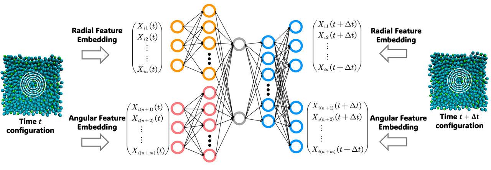

# supercooled_dynamics
time-lagged dynamical analysis for supercooled liquid

### Abstract

Unraveling the relationship between structural information and the dynamic properties of supercooled liquids is one of the great challenges of physics.  Dynamic heterogeneity, characterized by the propensity of particles, is often used as a proxy for dynamic slowing. Over the years, significant efforts have been made to capture the structural variations linked to dynamic heterogeneity in supercooled liquids. In this work, we present an innovative unsupervised machine learning protocol based on time-lagged canonical correlation analysis or time-lagged autoencoder to autonomously identify a key order parameter (OP) for the amorphous structures of the Kob-Andersen glass former. The OP is constructed by integrating numerous classical structural descriptors and represents the component with the strongest short-term correlation on a timescale thousands of times shorter than the relaxation time. Strikingly, this OP demonstrates a remarkable correlation with the propensity at long times, significantly outperforming traditional unsupervised models and rivaling supervised models. This demonstrates that fluctuations of structural descriptors contain sufficient information about the long-time dynamic heterogeneity. The most important structural features are the density distributions at mid-range.  As a consequence, the OP also exhibits excellent transferability in capturing dynamic heterogeneity across a wide temperature range and greatly facilitate the evaluation of descriptor importance, highlighting its potential for broader application to other glassy systems.

### Illustration

Thanks for open-sourcing!

[Go to Top](#Abstract)
