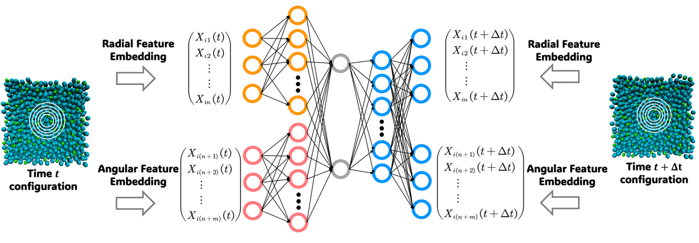

# supercooled_dynamics
time-lagged dynamical analysis for supercooled liquid

### Abstract

Understanding the dynamic heterogeneity of supercooled liquids based on local structural information has been a longstanding inquiry.  With the development of machine learning techniques, various advanced supervised learning algorithms have demonstrated considerable capability in correlating local structures with dynamical properties. However, supervised methods necessitate extensive training data generated from simulations, presenting a challenge. In this study, we introduce a more efficient implementation of the unsupervised learning method, which achieves comparable performance to supervised methods in predicting long-term dynamical propensities using significantly less data—specifically, only two short-time lagged configurations. Our approach is demonstrated in the Kob-Andersen system, where we showcase the success of our method and highlight the critical significance of slowly fluctuated structural features.

### Illustration

Thanks for open-sourcing!

[Go to Top](#Abstract)
